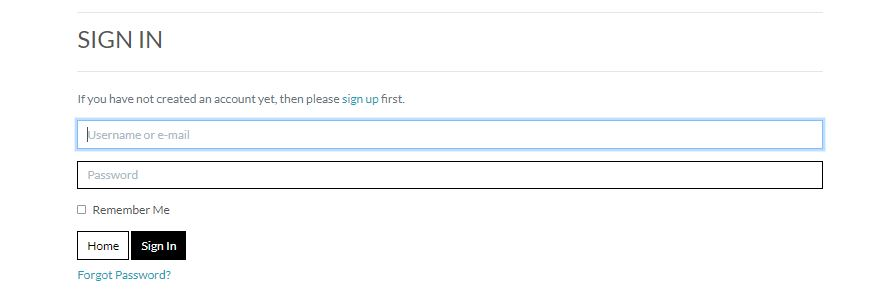

# Boutique Ado

In this section, you will include one or two paragraphs providing an overview of your project. Essentially, this part is your sales pitch. At this stage, you should have a name for your project so use it! Don’t introduce the project as a Portfolio project for the diploma. In this section, describe what the project hopes to accomplish, who it is intended to target and how it will be useful to the target audience.

## E-commerce Business Model 
Identify B2B, B2C - which type of e-comm business they are 

For example, ....

# User Experience (UX) Map with an agile tool

## User Stories

In this section, you will identify key target audiences for your site and hight their goals as user stories. Boutique Ado will have three different types of users; a store owner, a shopper and a site user. Below you will see some of their goals as user stories, keep in mind that the list of user stories for your own site will need to be more thorough.

### Shopper Goals
* As a shopper, I want to be able to sort a specific category of product, so that I can find the best-priced or best-rated product in a specific category, or sort the products in that category by name
* As a shopper, I want to be able to view items in my bad to be purchased so that I can identify the total cost of my purchase and all items I will receive 
* As a shopper, I want to be able to receive an email confirmation after checking out, so that I can keep confirmation of what I’ve purchased for my records. 
* As a shopper, I want to be able to view a list of products, so that I can select some to purchase

### Store Owner Goals
* As a store owner, I want to be able to add a product so that I can add new items to my store
* As a store owner, I want to be able to edit/update a product so that I can change product prices, descriptions, images and other product information
* As a store owner, I want to be able to delete a product, so that I can remove items that are no longer for sale 

### Site User Goals
* As a site user, I want to be able to easily register for an account, so that I can have a personal account and be able to view my profile
* As a site user, I want to be able to easily login or logout, so that I can access my personal information
* As a site user, I want to be able to easily receive an email confirmation after registering, so that I can verify that my account registration was successful
* As a site user, I want to be able to have a personalised user profile, so that I can view my personal order history and order confirmations, and save my payment information. 

## Marketing Strategy 

Double check marketing videos, identify which type of e-commerce business you are and cherry pick which strategies would be best suited to your business. 

eg: I am B2C, my customer is XX, they will be on FB for now. Furture strategy will be YYY 

### Facebook Page 

(screenshots of FB page) Include link to FB if possible

Distinction - detail what other applicable way of marketing their business (eg: Twitter, Instagram, Linkdein, TikTok) 

## SEO Implementatiom 

I've generated a sitemap and robots.txt to improve likeness with Google 

### Keywords
Identify a few relevant keyword (Pass)
Merit - at least 10 keywords and include why they chose them 
Distinction - why, which words they chose them, the reach the certain keywords have, niche market. Proof of extra research and write on the rationale behind the keywords. 

### Keyword Implementation 
Content
Meta tags 

## Design (remove the design section) 

* __Colour Scheme__
  * The two main colours user are black and white

* __Typography__
  * the font used

* __Imagery__
  * Imagery is important. The large, background hero image is designed to be striking and catch the user's attention. It also has a modern, energetic aesthetic.

## Wireframes 
* Home Page Wireframe - View
* Mobile Wireframe - View
* Contact Us Page Wireframe - View

# Features 
In this section, you should go over the different parts of your project, and describe each in a sentence or so. You will need to explain what value each of the features provides for the user, focusing on who this website is for, what it is that they want to achieve and how your project is the best way to help them achieve these things.

## Existing Features

* __Landing Page__
  - The landing includes a photograph with text overlay to allow the user to see exactly what the function of the site is. 
  - This section introduces the user to Boutique Ado with an eye catching image to grab their attention

* __Call To Action__
  - This section includes a line of text and a button, the button directs the user to the Products page 
  - The call to action is a quick way to direct the user to most important section/information of the site
 
 
 
* __Top Navigation Bar__
  - Featured on all three pages, the full responsive navigation bar includes links to the Home page (logo), All Products, Search function, My Account and Shooping Bag page and is identical in each page to allow for easy navigation.
   - This section will allow the user to easily navigate from page to page across all devices without having to revert back to the previous page via the ‘back’ button. 

* __Products__
  - These pages showcase all of the products that are available for purchase to the shopper
  - This allows the user to view a list of product so that they can select some to purchase

* __Product Details__
  - The user is brought to the product details page when clicking on a product from the main list 
  - This allowed the user to view individual poduct details so that they can identify the price, description, product rating, product image and available sizes.

* __Shopping Bag__
  - The user is directed to this page once they add a specific product to their shopping bag 
  - The shopping bag allows the user to view the items in their bag to be purchased, as well ass adjust the quantity of individual items in their bag so that they can make changes to their purchase before checkout
 

* __Sign In__
  - This page consists of a form that allow a user to easily login so that they can access their personal information. 
  - The user can also recover their password in case they forget it in order to recover access to their account. 

* __Sign Up__
  - The sign up page contains a form that allows a user to eaily register for an account so that they can have a personal account and be able to view their profile
  - The user will receive an email confirmation after registering, so that they can verify that their account registration was successful

* __Checkout__
  - The checkout page is one of the last pages users are directed to when making a purchase, this is where their personal information is collected. 
  - The user is able to easily enter their payment information, so that they can checkout quickly with no hassles. 
  - The user will receive an email confirmation after checking out, so that they can keep the confirmation of what they have purchase for their records. 

For some/all of your features, you may choose to reference the specific project files that implement them.

In addition, you may also use this section to discuss plans for additional features to be implemented in the future:

## Features Left to Implement

- Another feature idea

# Database 
Description of the Data Schema used 

# Testing

In this section, you need to convince the assessor that you have conducted enough testing to legitimately believe that the site works well. Essentially, in this part you will want to go over all of your project’s features and ensure that they all work as intended, with the project providing an easy and straightforward way for the users to achieve their goals.

In addition, you should mention in this section how your project looks and works on different browsers and screen sizes.
You should also mention in this section any interesting bugs or problems you discovered during your testing, even if you haven't addressed them yet.
If this section grows too long, you may want to split it off into a separate file and link to it from here.

## Validator Testing

- HTML
  - No errors were returned when passing through the official [W3C validator](https://validator.w3.org/nu/?doc=https%3A%2F%2Fcode-institute-org.github.io%2Flove-running-2.0%2Findex.html)
- CSS
  - No errors were found when passing through the official [(Jigsaw) validator](https://jigsaw.w3.org/css-validator/validator?uri=https%3A%2F%2Fvalidator.w3.org%2Fnu%2F%3Fdoc%3Dhttps%253A%252F%252Fcode-institute-org.github.io%252Flove-running-2.0%252Findex.html&profile=css3svg&usermedium=all&warning=1&vextwarning=&lang=en#css)

## Manual Testing

## Automated Testing

## Unfixed Bugs

You will need to mention unfixed bugs and why they were not fixed. This section should include shortcomings of the frameworks or technologies used. Although time can be a big variable to consider, paucity of time and difficulty understanding implementation is not a valid reason to leave bugs unfixed. 

# Deployment
This section should describe the process you went through to deploy the project to a hosting platform

## Local deployment

## Heroku deployment

# Credits

In this section, you need to reference where you got your content, media and extra help from. It is common practice to use code from other repositories and tutorials, however, it is important to be very specific about these sources to avoid plagiarism.

You can break the credits section up into Content and Media, depending on what you have included in your project.

## Content
* The text for the Home page was taken from Wikipedia Article A
* Instructions on how to implement form validation on the Sign-Up page was taken from Specific YouTube Tutorial
* The icons in the footer were taken from Font Awesome

## Media
* The photos used on the home and sign up page are from This Open Source site
* The images used for the gallery page were taken from this other open-source site

# Other General Project Advice

Below you will find a couple of extra tips that may be helpful when completing your project. Remember that each of these projects will become part of your final portfolio so it’s important to allow enough time to showcase your best work! 

- One of the most basic elements of keeping a healthy commit history is with the commit message. When getting started with your project, read through [this article](https://chris.beams.io/posts/git-commit/) by Chris Beams on How to Write  a Git Commit Message 
  - Make sure to keep the messages in the imperative mood 

- When naming the files in your project directory, make sure to consider meaningful naming of files, point to specific names and sections of content.
  - For example, instead of naming an image used ‘image1.png’ consider naming it ‘landing_page_img.png’. This will ensure that there are clear file paths kept. 

- Do some extra research on good and bad coding practices, there are a handful of useful articles to read, consider reviewing the following list when getting started:
  - [Writing Your Best Code](https://learn.shayhowe.com/html-css/writing-your-best-code/)
  - [HTML & CSS Coding Best Practices](https://medium.com/@inceptiondj.info/html-css-coding-best-practice-fadb9870a00f)
  - [Google HTML/CSS Style Guide](https://google.github.io/styleguide/htmlcssguide.html#General)

Getting started with your Portfolio Projects can be daunting, planning your project can make it a lot easier to tackle, take small steps to reach the final outcome and enjoy the process! 

